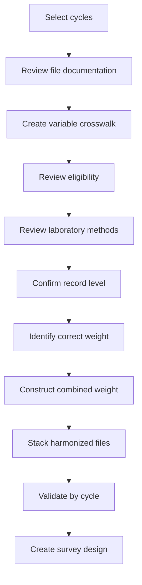

```{=html}
<style>
.cycles-hero {
  margin: 1rem 0 2rem;
  padding: 2.4rem 1.5rem;
  border: 1px solid #d8dee8;
  border-radius: 18px;
  background:
    radial-gradient(
      circle at top right,
      rgba(35, 139, 126, 0.11),
      transparent 34%
    ),
    radial-gradient(
      circle at bottom left,
      rgba(18, 48, 68, 0.08),
      transparent 32%
    ),
    #ffffff;
  box-shadow: 0 10px 28px rgba(22, 34, 51, 0.08);
}

.cycles-hero h2 {
  margin-top: 0;
  color: #111827;
  font-size: clamp(2rem, 5vw, 3.8rem);
  line-height: 1.08;
  letter-spacing: -0.03em;
}

.cycles-hero p {
  max-width: 860px;
  margin-bottom: 0;
  color: #374151;
  font-size: 1.12rem;
  line-height: 1.7;
}

.cycles-grid {
  display: grid;
  grid-template-columns:
    repeat(
      auto-fit,
      minmax(220px, 1fr)
    );
  gap: 1rem;
  margin: 1.5rem 0 2rem;
}

.cycles-card {
  padding: 1.3rem;
  border: 1px solid #d7dde6;
  border-radius: 14px;
  background: #ffffff;
  box-shadow: 0 5px 16px rgba(22, 34, 51, 0.06);
}

.cycles-card-number {
  display: inline-flex;
  align-items: center;
  justify-content: center;
  min-width: 2.3rem;
  height: 2.3rem;
  margin-bottom: 0.8rem;
  padding: 0 0.55rem;
  border-radius: 999px;
  background: #123044;
  color: #ffffff;
  font-weight: 800;
}

.cycles-card h3 {
  margin: 0 0 0.45rem;
  color: #111827;
  font-size: 1.16rem;
}

.cycles-card p {
  margin: 0;
  color: #4b5563;
  line-height: 1.55;
}

.cycles-pathway {
  display: grid;
  grid-template-columns:
    repeat(
      5,
      minmax(0, 1fr)
    );
  gap: 0.75rem;
  margin: 1.5rem 0 2rem;
}

.cycles-step {
  position: relative;
  padding: 1rem 0.8rem;
  border: 1px solid #dbe2e8;
  border-radius: 12px;
  background: #f8fbfb;
  text-align: center;
}

.cycles-step strong {
  display: block;
  margin-bottom: 0.35rem;
  color: #123044;
}

.cycles-step span {
  color: #4b5563;
  font-size: 0.91rem;
  line-height: 1.4;
}

.cycles-step:not(:last-child)::after {
  content: "→";
  position: absolute;
  top: 50%;
  right: -0.63rem;
  z-index: 2;
  transform: translateY(-50%);
  color: #238b7e;
  font-size: 1.2rem;
  font-weight: 800;
}

.cycles-concept {
  margin: 1rem 0;
  padding: 1rem 1.1rem;
  border-left: 5px solid #238b7e;
  border-radius: 8px;
  background: #f8fbfb;
}

.cycles-concept strong {
  color: #123044;
}

.compatibility-grid {
  display: grid;
  grid-template-columns:
    repeat(
      auto-fit,
      minmax(225px, 1fr)
    );
  gap: 1rem;
  margin: 1.5rem 0 2rem;
}

.compatibility-card {
  padding: 1.2rem;
  border: 1px solid #d7dde6;
  border-radius: 14px;
  background: #ffffff;
}

.compatibility-card h3 {
  margin-top: 0;
  color: #123044;
}

.compatibility-tag {
  display: inline-block;
  margin-bottom: 0.8rem;
  padding: 0.35rem 0.65rem;
  border-radius: 999px;
  background: #eef6f5;
  color: #16675f;
  font-size: 0.86rem;
  font-weight: 750;
}

.weight-example-grid {
  display: grid;
  grid-template-columns:
    repeat(
      auto-fit,
      minmax(250px, 1fr)
    );
  gap: 1rem;
  margin: 1.5rem 0 2rem;
}

.weight-example-card {
  padding: 1.3rem;
  border: 1px solid #d7dde6;
  border-radius: 14px;
  background: #ffffff;
  box-shadow: 0 5px 16px rgba(22, 34, 51, 0.05);
}

.weight-example-card h3 {
  margin-top: 0;
  color: #123044;
}

.weight-example-result {
  margin-top: 0.9rem;
  padding: 0.9rem;
  border-radius: 9px;
  background: #f3f6f8;
  color: #374151;
  font-family: monospace;
  text-align: center;
}

.cycles-actions {
  display: flex;
  flex-wrap: wrap;
  gap: 0.9rem;
  margin: 2rem 0;
}

.cycles-action {
  display: inline-flex !important;
  align-items: center;
  justify-content: center;
  min-height: 48px;
  padding: 0.8rem 1.15rem;
  border: 2px solid #123044;
  border-radius: 8px;
  background: #123044 !important;
  color: #ffffff !important;
  -webkit-text-fill-color: #ffffff !important;
  font-weight: 750;
  text-decoration: none !important;
}

.cycles-action:hover {
  background: #ffffff !important;
  color: #123044 !important;
  -webkit-text-fill-color: #123044 !important;
}

.cycles-action-secondary {
  background: #ffffff !important;
  color: #123044 !important;
  -webkit-text-fill-color: #123044 !important;
}

.cycles-action-secondary:hover {
  background: #123044 !important;
  color: #ffffff !important;
  -webkit-text-fill-color: #ffffff !important;
}

@media (max-width: 900px) {
  .cycles-pathway {
    grid-template-columns: 1fr;
  }

  .cycles-step:not(:last-child)::after {
    content: "↓";
    top: auto;
    right: 50%;
    bottom: -1.05rem;
    transform: translateX(50%);
  }

  .cycles-actions {
    flex-direction: column;
  }

  .cycles-action {
    width: 100%;
  }
}
</style>
```

::: {.cycles-hero}

## Combining cycles is a scientific decision

Appending rows from several NHANES cycles is technically simple.

Establishing that the resulting dataset is scientifically interpretable requires much more.

Before combining cycles, you must evaluate:

- variable definitions;
- measurement units;
- laboratory methods;
- participant eligibility;
- record structure;
- survey weights;
- the meaning of the combined period.

:::

::: {.callout-note icon="true"}
## Learning objectives

By the end of this page, you should be able to:

- explain why researchers combine NHANES cycles;
- distinguish stacking data from harmonizing data;
- assess variable, method, eligibility, record, and weight compatibility;
- construct multi-cycle weights for cycles beginning in 2001–2002;
- explain the special treatment required for 1999–2002;
- document assumptions about trends over a combined period.
:::

# Why combine survey cycles?

Individual two-year cycles may not provide enough observations for:

- small demographic groups;
- uncommon conditions;
- narrow age ranges;
- specialized laboratory subsamples;
- complex adjusted models;
- stable percentile estimates.

Combining adjacent cycles may increase:

- sample size;
- subgroup coverage;
- analytical stability;
- precision.

However, the interpretation changes.

A six-year pooled estimate describes the average population experience over six years. It does not describe one specific two-year cycle.

# The combining-cycle pathway

```{=html}
<div class="cycles-pathway">

  <div class="cycles-step">
    <strong>Select</strong>
    <span>Define the cycles and analytical period.</span>
  </div>

  <div class="cycles-step">
    <strong>Review</strong>
    <span>Compare variables, eligibility, and methods.</span>
  </div>

  <div class="cycles-step">
    <strong>Harmonize</strong>
    <span>Create consistent names, units, and coding.</span>
  </div>

  <div class="cycles-step">
    <strong>Weight</strong>
    <span>Construct the appropriate combined weight.</span>
  </div>

  <div class="cycles-step">
    <strong>Validate</strong>
    <span>Review rows, keys, missingness, and cycle coverage.</span>
  </div>

</div>
```

# Stacking is not harmonization

This code stacks rows:

```r
combined_data <- dplyr::bind_rows(
  cycle_1,
  cycle_2,
  cycle_3
)
```

It does not establish that:

- the variables mean the same thing;
- units are identical;
- eligible ages are identical;
- specimens were handled consistently;
- laboratory methods are comparable;
- survey weights were adjusted;
- repeated examinations were handled correctly;
- the same population is represented.

::: {.callout-warning icon="true"}
## A successful `bind_rows()` is not proof of scientific compatibility

R can combine files even when their measurements should not be analyzed together.

Compatibility must be established before interpretation.
:::

# Five compatibility domains

```{=html}
<div class="compatibility-grid">

  <div class="compatibility-card">
    <div class="compatibility-tag">Domain 1</div>
    <h3>Variables</h3>
    <p>
      Review names, labels, units, coding, missing-value conventions, detection limits, and derived values.
    </p>
  </div>

  <div class="compatibility-card">
    <div class="compatibility-tag">Domain 2</div>
    <h3>Laboratory methods</h3>
    <p>
      Review instruments, specimen handling, calibration, quality control, method changes, and correction guidance.
    </p>
  </div>

  <div class="compatibility-card">
    <div class="compatibility-tag">Domain 3</div>
    <h3>Eligibility</h3>
    <p>
      Compare age restrictions, examination status, fasting requirements, pregnancy criteria, and subsample selection.
    </p>
  </div>

  <div class="compatibility-card">
    <div class="compatibility-tag">Domain 4</div>
    <h3>Record structure</h3>
    <p>
      Determine whether each row represents a participant, repeat examination, specimen, recall, or other event.
    </p>
  </div>

  <div class="compatibility-card">
    <div class="compatibility-tag">Domain 5</div>
    <h3>Survey design and weights</h3>
    <p>
      Identify the correct component weight, special multi-year weights, and any cycle-specific design guidance.
    </p>
  </div>

</div>
```

# Explore each compatibility domain

::: {.panel-tabset}

## Variable compatibility

Confirm:

- variable names;
- labels;
- units;
- coding;
- missing-value conventions;
- lower detection-limit variables;
- derived versus directly measured values.

Example crosswalk:

| Cycle | Source variable | Harmonized variable | Unit | Decision |
|---|---|---|---|---|
| 1999–2000 | `LBXHGB` | `hemoglobin_g_dl` | g/dL | Retain |
| 2001–2002 | `LBXHGB` | `hemoglobin_g_dl` | g/dL | Retain |
| Later cycle | Alternative name | `hemoglobin_g_dl` | g/dL | Rename after verification |

## Laboratory-method compatibility

Review:

- instrument manufacturer;
- analyzer model;
- laboratory site;
- specimen type;
- specimen handling;
- calibration;
- quality-control procedures;
- method changes;
- correction equations;
- analytical recommendations.

A method change does not always prevent combining data, but it must be assessed and documented.

## Eligibility compatibility

Confirm:

- eligible ages;
- sex restrictions;
- examination status;
- pregnancy exclusions;
- fasting requirements;
- subsample selection;
- specimen availability;
- collection-session restrictions.

## Record-level compatibility

Determine whether each file contains:

- one row per participant;
- repeated examinations;
- multiple specimens;
- replicate laboratory measurements;
- day-level records;
- medication-level records;
- household-level records.

## Survey-design compatibility

Determine:

- which weight applies to each component;
- whether the same weight variable exists in every cycle;
- whether a component-specific subsample changed;
- whether a supplied multi-year weight must be used;
- whether a new combined weight must be constructed.

:::

::: {.cycles-concept}
**Core principle:** A variable should be combined only after its scientific meaning, measurement process, eligible population, and survey design have been reviewed across all included cycles.
:::

# Build a formal compatibility table

Maintain a table such as:

| Cycle | File | Eligible sample | Record level | Method status | Weight | Include? |
|---|---|---|---|---|---|---|
| 1999–2000 | CBC file | Documented CBC sample | Person | Reviewed | MEC or four-year weight | Yes |
| 2001–2002 | Primary CBC | Documented CBC sample | Person | Reviewed | MEC or four-year weight | Yes |
| 2001–2002 | Second CBC exam | Convenience repeat sample | Repeat exam | Separate analysis | Not used for representative primary trend | Separate |
| 2003–2004 | CBC file | Documented CBC sample | Person | Reviewed | MEC | Yes |

This table converts undocumented judgment into an auditable analytical decision.

# Weight construction from 2001–2002 onward

For compatible two-year cycles beginning in 2001–2002 or later, a multi-cycle weight is commonly created by dividing the two-year weight by the number of cycles combined.

```{=html}
<div class="weight-example-grid">

  <div class="weight-example-card">
    <h3>Three compatible cycles</h3>
    <p>
      Divide the two-year weight by three.
    </p>
    <div class="weight-example-result">
      WTMEC2YR / 3
    </div>
  </div>

  <div class="weight-example-card">
    <h3>Five compatible cycles</h3>
    <p>
      Divide the two-year weight by five.
    </p>
    <div class="weight-example-result">
      WTMEC2YR / 5
    </div>
  </div>

</div>
```

For three compatible cycles:

```r
analysis_data <- analysis_data |>
  dplyr::mutate(
    combined_mec_weight =
      WTMEC2YR / 3
  )
```

For five compatible cycles:

```r
analysis_data <- analysis_data |>
  dplyr::mutate(
    combined_mec_weight =
      WTMEC2YR / 5
  )
```

This applies only when:

- the cycles begin in 2001–2002 or later;
- the same type of weight is appropriate;
- the components are compatible;
- no special official weighting instruction applies.

# Special treatment of 1999–2002

The 1999–2000 two-year weights and later two-year weights were constructed using different population bases.

Therefore, analyses combining 1999–2000 and 2001–2002 must begin with the NCHS-provided four-year weight.

Common four-year variables include:

```text
WTINT4YR
WTMEC4YR
```

A four-year component-specific subsample weight must be used where applicable.

::: {.callout-important icon="true"}
## Do not create a 1999–2002 weight by dividing two two-year weights by two

Use the supplied NCHS four-year weight for the 1999–2002 period.
:::

# Example: combining 1999–2004

This period includes:

- 1999–2000;
- 2001–2002;
- 2003–2004.

The combined MEC weight uses:

- `WTMEC4YR` for records from 1999–2002;
- `WTMEC2YR` for records from 2003–2004.

```r
analysis_data <- analysis_data |>
  dplyr::mutate(
    combined_mec_weight =
      dplyr::case_when(
        survey_cycle %in% c(
          "1999-2000",
          "2001-2002"
        ) ~
          (2 / 3) *
          WTMEC4YR,

        survey_cycle ==
          "2003-2004" ~
          (1 / 3) *
          WTMEC2YR,

        TRUE ~
          NA_real_
      )
  )
```

The coefficients reflect the contribution of the represented periods:

```text
1999–2002 block → supplied four-year weight
2003–2004 block → supplied two-year weight
```

# Example: combining 2003–2008

This period contains three compatible two-year cycles:

- 2003–2004;
- 2005–2006;
- 2007–2008.

```r
analysis_data <- analysis_data |>
  dplyr::mutate(
    combined_mec_weight =
      WTMEC2YR / 3
  )
```

# Example: the 1999–2018 CBC pipeline

The current CBC pipeline covers ten cycles:

```text
1999–2000
2001–2002
2003–2004
2005–2006
2007–2008
2009–2010
2011–2012
2013–2014
2015–2016
2017–2018
```

That is a 20-year combined period.

A formal weighted analysis must:

1. begin with the supplied 1999–2002 four-year weight;
2. combine it with the eight later two-year weights;
3. use the correct component-level weight;
4. verify CBC method and eligibility compatibility;
5. describe the result as representing the combined 20-year period.

A conceptual MEC-weight construction is:

```r
analysis_data <- analysis_data |>
  dplyr::mutate(
    combined_mec_weight =
      dplyr::case_when(
        survey_cycle %in% c(
          "1999-2000",
          "2001-2002"
        ) ~
          (4 / 20) *
          WTMEC4YR,

        survey_cycle %in% c(
          "2003-2004",
          "2005-2006",
          "2007-2008",
          "2009-2010",
          "2011-2012",
          "2013-2014",
          "2015-2016",
          "2017-2018"
        ) ~
          (2 / 20) *
          WTMEC2YR,

        TRUE ~
          NA_real_
      )
  )
```

This example assumes that:

- the MEC weight is appropriate;
- the variables are comparable;
- the objective is a combined-period estimate;
- all required design variables are present.

A component-specific subsample weight would replace the MEC weight where required.

# Preserve original and derived weights

Never overwrite:

```text
WTMEC2YR
```

Create a new variable such as:

```text
combined_mec_weight
```

This keeps the weighting decision visible and auditable.

# Pooled analysis versus trend analysis

::: {.panel-tabset}

## Pooled analysis

A pooled analysis treats the selected cycles as one combined analytical period.

Example question:

> What was the weighted mean hemoglobin concentration among adults during 2003–2008?

The result represents the combined period rather than any single cycle.

## Trend analysis

A trend analysis compares cycles or models time.

Example question:

> Did mean hemoglobin change from 1999–2000 through 2017–2018?

For trend analysis, retaining the individual survey-cycle identifier is essential.

```r
analysis_data <- analysis_data |>
  dplyr::mutate(
    survey_cycle =
      factor(
        survey_cycle,
        levels = c(
          "1999-2000",
          "2001-2002",
          "2003-2004",
          "2005-2006",
          "2007-2008",
          "2009-2010",
          "2011-2012",
          "2013-2014",
          "2015-2016",
          "2017-2018"
        )
      )
  )
```

:::

# The no-trend assumption

Pooling cycles into one estimate assumes that averaging across the selected period is scientifically meaningful.

A pooled estimate may conceal substantial changes in:

- disease prevalence;
- treatment;
- health policy;
- population composition;
- laboratory methods;
- specimen handling;
- environmental exposure;
- data collection conditions.

Before pooling, inspect:

- cycle-specific estimates;
- method documentation;
- population changes;
- major public-health events;
- policy or treatment changes;
- interruptions in data collection.

::: {.cycles-concept}
**Core principle:** A pooled estimate summarizes a period. A trend analysis evaluates change within that period. These are different scientific questions.
:::

# Recommended harmonization workflow



# Validation after combining cycles

::: {.panel-tabset}

## Row counts

```r
combined_data |>
  dplyr::count(
    survey_cycle,
    name =
      "records"
  )
```

This confirms that every intended cycle is represented.

## Duplicate participant keys

```r
combined_data |>
  dplyr::count(
    survey_cycle,
    SEQN,
    name =
      "occurrences"
  ) |>
  dplyr::filter(
    occurrences > 1
  )
```

This checks the cycle-aware participant key.

## Weight availability

```r
combined_data |>
  dplyr::group_by(
    survey_cycle
  ) |>
  dplyr::summarise(
    records =
      dplyr::n(),

    positive_weight =
      sum(
        combined_mec_weight > 0,
        na.rm =
          TRUE
      ),

    missing_weight =
      sum(
        is.na(
          combined_mec_weight
        )
      ),

    .groups =
      "drop"
  )
```

## Major-variable missingness

```r
combined_data |>
  dplyr::group_by(
    survey_cycle
  ) |>
  dplyr::summarise(
    hemoglobin_missing =
      sum(
        is.na(
          LBXHGB
        )
      ),

    hemoglobin_available =
      sum(
        !is.na(
          LBXHGB
        )
      ),

    .groups =
      "drop"
  )
```

:::

# Outputs every multi-cycle pipeline should provide

```{=html}
<div class="cycles-grid">

  <div class="cycles-card">
    <div class="cycles-card-number">A</div>
    <h3>Source evidence</h3>
    <p>
      Source manifest, cycle coverage, file roles, URLs, and provenance.
    </p>
  </div>

  <div class="cycles-card">
    <div class="cycles-card-number">B</div>
    <h3>Compatibility evidence</h3>
    <p>
      Variable crosswalk, method review, eligibility review, and record-level assessment.
    </p>
  </div>

  <div class="cycles-card">
    <div class="cycles-card-number">C</div>
    <h3>Weight evidence</h3>
    <p>
      Applicable-weight guidance, construction code, original weights, and derived weights.
    </p>
  </div>

  <div class="cycles-card">
    <div class="cycles-card-number">D</div>
    <h3>Validation evidence</h3>
    <p>
      Row counts, duplicate-key reports, missingness summaries, and cycle-specific diagnostics.
    </p>
  </div>

</div>
```

A complete pipeline should provide:

- source-file manifest;
- cycle-coverage table;
- variable crosswalk;
- method-review table;
- eligibility review;
- applicable-weight guidance;
- weight-construction code;
- original and derived weights;
- cycle-level row counts;
- duplicate-key report;
- missingness summary;
- provenance manifest;
- analytical limitations.

# Combining-cycle decision challenge

Suppose three files can be joined because they share the same variables and column classes.

Does that prove they can be analyzed together?

::: {.callout-note collapse="true"}
## Reveal the answer

No.

You must still verify:

- scientific meaning;
- measurement units;
- laboratory methods;
- analytical eligibility;
- record structure;
- survey-weight compatibility;
- the interpretation of the combined period.
:::

# Special-period challenge

How should 1999–2000 and 2001–2002 ordinarily be weighted together?

::: {.callout-note collapse="true"}
## Reveal the answer

Use the supplied NCHS four-year weight for 1999–2002.

Do not construct the four-year weight by simply dividing two separate two-year weights by two.
:::

# Combining-cycle checklist

Before describing a combined dataset as analysis-ready, confirm:

- [ ] Every cycle is listed explicitly.
- [ ] Variable names and meanings are harmonized.
- [ ] Units are compatible.
- [ ] Laboratory methods have been reviewed.
- [ ] Eligibility rules are compatible.
- [ ] Record levels are understood.
- [ ] Repeat examinations are handled separately.
- [ ] The appropriate component weight is identified.
- [ ] Supplied 1999–2002 four-year weights are used where required.
- [ ] Later two-year weights are scaled appropriately.
- [ ] Original weights are preserved.
- [ ] Derived weights have new names.
- [ ] The represented survey period is stated.
- [ ] Cycle-specific diagnostics have been reviewed.
- [ ] Assumptions about pooling and trends are documented.

# Quick knowledge check

::: {.callout-note collapse="true"}
## Does `bind_rows()` prove that laboratory measurements are compatible?

No. It only stacks records. Methods, units, eligibility, record level, and weights must be reviewed separately.
:::

::: {.callout-note collapse="true"}
## Why should the cycle identifier be retained?

It supports provenance, validation, cycle-specific summaries, method review, and trend analysis.
:::

::: {.callout-note collapse="true"}
## Should the original survey weight be overwritten?

No. Create a separate combined-weight variable so the transformation remains visible and auditable.
:::

::: {.callout-note collapse="true"}
## What does a pooled estimate represent?

It represents the average population experience over the entire combined period.
:::

::: {.callout-note collapse="true"}
## What is the main risk of pooling cycles without inspecting trends?

A single pooled estimate may conceal important changes across cycles.
:::

# Continue through the site

```{=html}
<div class="cycles-actions">

  <a
    class="cycles-action cycles-action-secondary"
    href="survey-weights.html"
  >
    Return to survey weights
  </a>

  <a
    class="cycles-action"
    href="../laboratory/index.html"
  >
    Explore laboratory data →
  </a>

  <a
    class="cycles-action cycles-action-secondary"
    href="index.html"
  >
    Return to foundations overview
  </a>

</div>
```

# Page summary

Combining cycles requires more than stacking files.

A defensible process must address:

```text
variable harmonization
laboratory methods
eligibility
record structure
duplicate keys
survey weights
period interpretation
```

The final question is not simply:

```text
Can these files be combined?
```

It is:

```text
Can these cycles be combined in a way that preserves their scientific meaning?
```