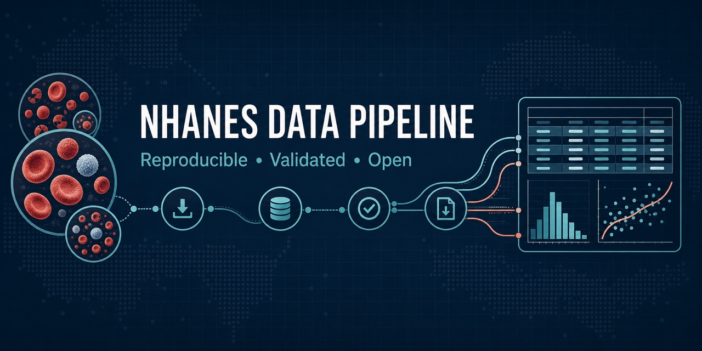

```{=html}
<section class="home-hero" aria-labelledby="home-title">
  <div class="home-shell home-hero-grid">
    <div class="hero-content">
      <p class="kicker"><span class="status-dot" aria-hidden="true"></span> Open-source scientific infrastructure</p>
      <h1 id="home-title">NHANES data you can trace, validate, and reuse.</h1>
      <p class="hero-lead">A reproducible R pipeline that turns official CDC/NCHS public-use files into documented research assets—with scientific decisions kept visible at every step.</p>
      <div class="button-row">
        <a class="button button-primary" href="NhanesDownloadScripts.html">Read the data guide</a>
        <a class="button button-secondary" href="https://github.com/simonaseno/NHANES" target="_blank" rel="noopener">View on GitHub</a>
      </div>
      <ul class="trust-list" aria-label="Project qualities">
        <li>Official CDC sources</li>
        <li>Automated validation</li>
        <li>MIT licensed</li>
      </ul>
    </div>

    <figure class="hero-figure">
      
      <figcaption>From public-use source files to defensible scientific analysis.</figcaption>
    </figure>
  </div>
</section>

<section class="activity-section" aria-labelledby="activity-title">
  <div class="home-shell">
    <div class="section-heading split-heading">
      <div>
        <p class="kicker kicker-dark">Transparent from the beginning</p>
        <h2 id="activity-title">Repository activity</h2>
      </div>
      <p class="heading-note">A dated snapshot of verifiable GitHub data—not estimated or seeded counters.</p>
    </div>

    <div class="activity-grid">
      <article class="activity-card accent-navy">
        <span class="activity-label">Public since</span>
        <strong>Jul 17, 2025</strong>
        <small>Repository creation date</small>
      </article>
      <article class="activity-card accent-cyan">
        <span class="activity-label">Current version</span>
        <strong>v0.2.0</strong>
        <small>Software citation metadata</small>
      </article>
      <article class="activity-card accent-blue">
        <span class="activity-label">Repository views</span>
        <strong>1</strong>
        <small>1 unique · trailing 14 days</small>
      </article>
      <article class="activity-card accent-teal">
        <span class="activity-label">Repository clones</span>
        <strong>7</strong>
        <small>6 unique · trailing 14 days</small>
      </article>
      <article class="activity-card accent-coral">
        <span class="activity-label">GitHub stars</span>
        <strong>0</strong>
        <small>Public repository count</small>
      </article>
      <article class="activity-card accent-slate">
        <span class="activity-label">Release downloads</span>
        <strong>—</strong>
        <small>No GitHub release published yet</small>
      </article>
    </div>

    <p class="snapshot-note">Snapshot verified August 2, 2026. GitHub traffic covers repository activity for the available 14-day window; it does not measure visits to this documentation website.</p>
  </div>
</section>

<section class="home-section" aria-labelledby="workflow-title">
  <div class="home-shell">
    <div class="section-heading centered-heading">
      <p class="kicker kicker-dark">A reviewable workflow</p>
      <h2 id="workflow-title">Four deliberate steps from source to science</h2>
      <p>Each layer has a clear responsibility, so data acquisition never hides scientific assumptions.</p>
    </div>

    <div class="workflow-grid">
      <article class="workflow-card">
        <span class="step">01</span>
        <h3>Acquire</h3>
        <p>Retrieve declared files directly from official CDC/NCHS sources through a reviewed catalog.</p>
      </article>
      <article class="workflow-card">
        <span class="step">02</span>
        <h3>Validate</h3>
        <p>Stop when row counts, schemas, participant keys, or merge contracts differ from expectations.</p>
      </article>
      <article class="workflow-card">
        <span class="step">03</span>
        <h3>Harmonize</h3>
        <p>Apply component-specific scientific rules without burying them inside generic download code.</p>
      </article>
      <article class="workflow-card">
        <span class="step">04</span>
        <h3>Document</h3>
        <p>Record sources, retrieval times, hashes, dimensions, validation results, and release versions.</p>
      </article>
    </div>
  </div>
</section>

<section class="evidence-section" aria-labelledby="evidence-title">
  <div class="home-shell evidence-grid">
    <div class="evidence-copy">
      <p class="kicker kicker-dark">Protection by design</p>
      <h2 id="evidence-title">Scientific meaning belongs in the pipeline.</h2>
      <p>The 2001–2002 second CBC examination is a convenience sample without survey weights. This project preserves those observations separately instead of silently appending them to the representative primary examination data.</p>
      <p>That safeguard prevents <strong>557 duplicate participants</strong> from entering the combined CBC-demographic output unnoticed.</p>
      <a class="text-link" href="NhanesDownloadScripts.html#cbc-first-and-second-examinations">Read the scientific rationale <span aria-hidden="true">→</span></a>
    </div>

    <aside class="coverage-card" aria-label="Current validated coverage">
      <p class="coverage-eyebrow">Current validated coverage</p>
      <div class="coverage-stat"><strong>10</strong><span>continuous survey cycles</span></div>
      <div class="coverage-stat"><strong>1999–2018</strong><span>release period</span></div>
      <div class="coverage-stat"><strong>2</strong><span>core components: CBC and Demographics</span></div>
    </aside>
  </div>
</section>

<section class="home-section" aria-labelledby="growth-title">
  <div class="home-shell">
    <div class="section-heading centered-heading">
      <p class="kicker kicker-dark">Designed to expand carefully</p>
      <h2 id="growth-title">A foundation for more NHANES components</h2>
    </div>

    <div class="principle-grid">
      <article class="principle-card">
        <h3>Manifest-driven</h3>
        <p>New files begin as reviewed catalog entries—not URLs buried inside analysis notebooks.</p>
      </article>
      <article class="principle-card">
        <h3>Component-aware</h3>
        <p>Every component receives its own granularity, harmonization, eligibility, and weighting review.</p>
      </article>
      <article class="principle-card">
        <h3>Citation-ready</h3>
        <p>Versioned metadata and provenance make every research release easier to describe and audit.</p>
      </article>
    </div>
  </div>
</section>

<section class="home-cta" aria-labelledby="cta-title">
  <div class="home-shell cta-inner">
    <div>
      <p class="kicker">Start with the current release</p>
      <h2 id="cta-title">Explore CBC and Demographics across ten cycles.</h2>
      <p>Follow the reproducible workflow or suggest the next NHANES component for the project.</p>
    </div>
    <div class="button-row cta-buttons">
      <a class="button button-light" href="NhanesDownloadScripts.html">Open the data guide</a>
      <a class="button button-outline" href="https://github.com/simonaseno/NHANES/issues/new" target="_blank" rel="noopener">Request a component</a>
    </div>
  </div>
</section>
```
