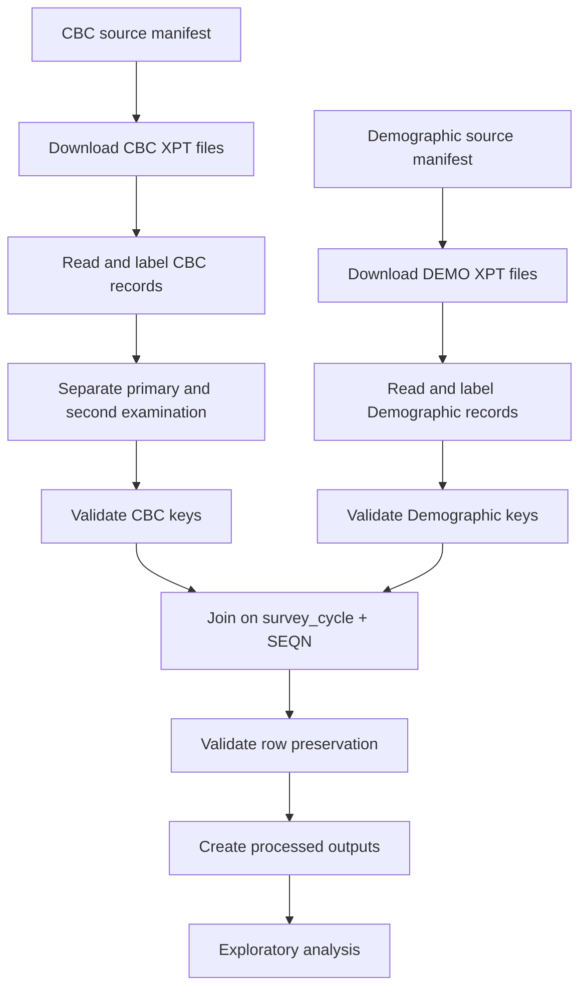

::: {.callout-note icon="true"}
## Pipeline scope

This pipeline processes:

- primary Complete Blood Count data;
- Demographic data;
- ten continuous NHANES cycles;
- 1999–2000 through 2017–2018;
- participant and survey-cycle metadata;
- survey-design variables;
- repeat-examination audit records;
- validation and provenance outputs.
:::

## Why CBC was selected first

CBC data provide a strong foundation for demonstrating:

- multi-cycle acquisition;
- variable continuity;
- person-level laboratory records;
- integration with Demographics;
- duplicate investigation;
- repeat-examination handling;
- exploratory trend analysis.

CBC results are also broadly relevant across:

- anemia;
- infection and inflammation;
- hematologic abnormalities;
- platelet disorders;
- nutritional status;
- population-health monitoring.

## Current coverage

| Attribute | Implementation |
|---|---|
| Laboratory component | Complete Blood Count |
| Supporting component | Demographics |
| First cycle | 1999–2000 |
| Final cycle | 2017–2018 |
| Continuous cycles | 10 |
| CBC source files | 11 source files, including a second-exam file |
| Demographic source files | 10 |
| Primary key | `survey_cycle + SEQN` |
| Primary language | R |
| Raw format | SAS transport `.xpt` |
| Main processed format | `.rds` |
| Shareable format | Optional `.csv` |

## Pipeline architecture



## CBC source-file structure

The primary source sequence includes historical naming differences.

Examples include:

- `LAB25`;
- `L25_B`;
- `L25_C`;
- `CBC_D`;
- later `CBC_` files.

The file name changes do not by themselves establish variable comparability.

Each source entry must include:

- survey cycle;
- release directory;
- file name;
- analytic role;
- expected record level.

## Demographic source-file structure

Demographics files are generally named:

- `DEMO`;
- `DEMO_B`;
- `DEMO_C`;
- continuing through later cycle suffixes.

They provide supporting information such as:

- `SEQN`;
- age;
- sex;
- race and Hispanic origin;
- interview and MEC weights;
- `SDMVSTRA`;
- `SDMVPSU`;
- other demographic variables.

## The 2001–2002 second examination

The 2001–2002 release contains:

```text
L25_B.xpt
L25_2_B.xpt
```

`L25_B` contains the primary CBC examination.

`L25_2_B` contains a second CBC examination and includes variables such as:

- days between examinations;
- second-exam white blood cell count;
- second-exam red blood cell count;
- second-exam hemoglobin;
- second-exam hematocrit;
- second-exam platelet count.

The second-exam variables use distinct names such as:

```text
LB2HGB
LB2HCT
LB2RBCSI
LB2PLTSI
```

They are not simply another release of the primary person-level CBC data.

## Duplicate risk in the legacy approach

A row-binding approach such as:

```r
dplyr::bind_rows(
  l25_b,
  l25_2_b
)
```

can create multiple rows for the same participant and cycle.

That would violate the intended person-level key:

```text
survey_cycle + SEQN
```

## Current duplicate policy

The pipeline:

1. reads the primary examination;
2. reads the second examination;
3. identifies shared participant identifiers;
4. preserves the second examination separately;
5. excludes it from the primary person-level CBC dataset;
6. creates a repeat-examination audit;
7. prevents silent inclusion in population-trend summaries.

Primary output:

```text
cbc_primary_1999_2018
```

Supplementary output:

```text
cbc_second_exam_2001_2002
```

## Why the second examination is retained

The second-exam data may be scientifically useful for:

- within-person variability;
- repeatability;
- measurement reliability;
- short-term biological variation;
- method-comparison studies.

It should not be discarded merely because it does not belong in the primary person-level trend dataset.

## Merge contract

Both primary CBC and Demographics must be unique on:

```text
survey_cycle + SEQN
```

CBC key validation:

```r
cbc_key_check <- cbc_primary |>
  dplyr::count(
    survey_cycle,
    SEQN,
    name = "occurrences"
  ) |>
  dplyr::filter(
    occurrences > 1
  )
```

Demographic key validation:

```r
demo_key_check <- demo_data |>
  dplyr::count(
    survey_cycle,
    SEQN,
    name = "occurrences"
  ) |>
  dplyr::filter(
    occurrences > 1
  )
```

The pipeline proceeds only when the intended key contract is satisfied.

## Why the cycle belongs in the key

A multi-cycle dataset should not depend on an undocumented assumption that `SEQN` is globally unique across every release.

Using:

```text
survey_cycle + SEQN
```

makes the cycle relationship explicit.

It also supports:

- cycle-level validation;
- provenance;
- debugging;
- future compatibility;
- safe joins.

## Protected merge

Conceptual merge:

```r
cbc_demo_merged <- cbc_primary |>
  dplyr::inner_join(
    demo_data,
    by = c(
      "survey_cycle",
      "SEQN"
    ),
    relationship = "one-to-one"
  )
```

The actual relationship must be established by the validation checks before the strict join is run.

## Pre-merge anti-joins

CBC records without Demographics:

```r
cbc_without_demo <- cbc_primary |>
  dplyr::anti_join(
    demo_data,
    by = c(
      "survey_cycle",
      "SEQN"
    )
  )
```

Demographic records without CBC:

```r
demo_without_cbc <- demo_data |>
  dplyr::anti_join(
    cbc_primary,
    by = c(
      "survey_cycle",
      "SEQN"
    )
  )
```

The second anti-join is expected to contain many records because not every Demographic participant necessarily has a valid CBC record.

The first anti-join requires careful review because each CBC record should ordinarily link to its participant's Demographic record.

## Row-preservation validation

After the join:

```r
stopifnot(
  nrow(cbc_demo_merged) ==
    nrow(cbc_primary)
)
```

Also validate uniqueness:

```r
merged_key_check <- cbc_demo_merged |>
  dplyr::count(
    survey_cycle,
    SEQN,
    name = "occurrences"
  ) |>
  dplyr::filter(
    occurrences > 1
  )
```

Expected result:

```text
0 duplicate merged keys
```

## Readable labels

Original coded variables are preserved.

Readable variables are added:

```r
cbc_demo_merged <- cbc_demo_merged |>
  dplyr::mutate(
    sex = dplyr::case_when(
      RIAGENDR == 1 ~ "Male",
      RIAGENDR == 2 ~ "Female",
      TRUE ~ NA_character_
    ),
    age_years = RIDAGEYR
  )
```

## Survey-design variables

The merged dataset preserves variables needed for later design-based analysis, including:

```text
WTINT2YR
WTMEC2YR
SDMVSTRA
SDMVPSU
```

For 1999–2002, supplied four-year weights may also be required for combined-cycle inference.

The pipeline does not assign one universal analysis weight because the correct choice depends on:

- variables included;
- eligible sample;
- analysis period;
- whether a specialized subsample is used.

## Core outputs

Recommended processed data:

```text
data/processed/
├── cbc_primary_1999_2018.rds
├── cbc_second_exam_2001_2002.rds
├── demographics_1999_2018.rds
└── cbc_demographics_1999_2018.rds
```

Recommended validation outputs:

```text
outputs/validation/
├── source_summary.csv
├── key_validation.csv
├── merge_validation.csv
├── unmatched_cbc_records.csv
├── package_versions.csv
└── session_info.txt
```

Recommended duplicate outputs:

```text
outputs/duplicate-reports/
├── shared_second_exam_participants.csv
├── exact_duplicate_rows.csv
└── unresolved_conflicts.csv
```

## Exploratory analysis

The beginner tutorial creates a descriptive hemoglobin summary:

```r
hemoglobin_summary <- cbc_demo_merged |>
  dplyr::filter(
    !is.na(LBXHGB),
    !is.na(sex)
  ) |>
  dplyr::group_by(
    survey_cycle,
    sex
  ) |>
  dplyr::summarise(
    participants = dplyr::n(),
    mean_hemoglobin = mean(
      LBXHGB,
      na.rm = TRUE
    ),
    sd_hemoglobin = stats::sd(
      LBXHGB,
      na.rm = TRUE
    ),
    median_hemoglobin = stats::median(
      LBXHGB,
      na.rm = TRUE
    ),
    .groups = "drop"
  )
```

::: {.callout-warning icon="true"}
## Exploratory does not mean nationally representative

The unweighted summary describes the analytical records.

Formal NHANES population estimates require:

- the correct component weight;
- combined-cycle weighting;
- `SDMVSTRA`;
- `SDMVPSU`;
- a complex-survey analysis.
:::

## Validation requirements

The CBC pipeline is considered analysis-ready only when:

- [ ] every declared source is accounted for;
- [ ] failed downloads are reported;
- [ ] every primary file contains `SEQN`;
- [ ] cycle metadata are present;
- [ ] the second examination is separate;
- [ ] primary CBC keys are unique;
- [ ] Demographic keys are unique;
- [ ] CBC records link to Demographics;
- [ ] the join preserves primary CBC row counts;
- [ ] merged keys remain unique;
- [ ] validation reports are saved;
- [ ] package and session information are recorded.

## Known limitations

The pipeline does not by itself resolve:

- clinical interpretation;
- causal inference;
- every historical method change;
- all possible age or pregnancy exclusions;
- specialized disease definitions;
- the correct weight for every research question;
- complex-survey trend modeling.

Those decisions belong in the analysis protocol.

## Learning and technical resources

[Start the beginner CBC tutorial](../../tutorial/index.qmd){.button .button-primary}

[Read the technical guide](../../NhanesDownloadScripts.qmd){.button .button-secondary}

[Learn about survey weights](../../foundations/survey-weights.qmd)

[Learn about combining cycles](../../foundations/combining-cycles.qmd)

## Future development

The CBC pipeline provides an architectural starting point for:

- glycohemoglobin;
- urine albumin and creatinine;
- lipids;
- standard biochemistry;
- environmental biomarkers.

Each future component will retain the shared reproducibility framework while implementing its own scientific rules.