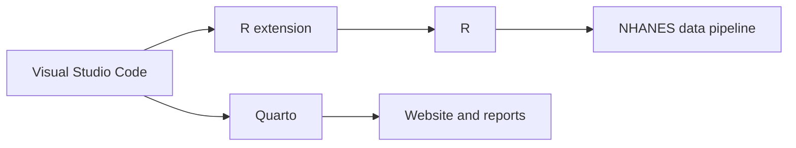

::: {.callout-note icon="true"}
## Learning objectives

By the end of this lesson, you should be able to:

- identify the software required for the course;
- install R;
- install Visual Studio Code;
- install the R extension;
- install or verify Quarto;
- confirm that R and Quarto are available from the terminal.
:::

## Required software

This tutorial uses:

| Tool | Purpose |
|---|---|
| R | Executes the data-processing and analysis code |
| Visual Studio Code | Provides the code editor and project workspace |
| R extension for VS Code | Connects the editor to an active R session |
| Quarto | Renders the tutorial website and reproducible documents |
| Web browser | Displays the rendered documentation |

## Step 1 — Install R

R is the programming language that will:

- download the NHANES files;
- read SAS transport files;
- transform data;
- validate keys;
- merge components;
- create summaries;
- generate figures.

### macOS

1. Open the official R project download page.
2. Select the macOS download option.
3. Download the installer appropriate for your computer.
4. Open the `.pkg` installer.
5. Follow the installation prompts.
6. Restart VS Code if it was open during installation.

Apple Silicon Macs and Intel Macs may use different installers.

### Windows

1. Open the official R project download page.
2. Select the Windows download option.
3. Select **base**.
4. Download the installer.
5. Run the `.exe` file.
6. Accept the standard installation options.
7. Restart VS Code.

## Verify R

Open a terminal and run:

```bash
R --version
```

A successful result resembles:

```text
R version 4.x.x
Platform: ...
```

The precise version may differ.

::: {.callout-tip icon="true"}
## The exact version number is not the key check

The important result is that the terminal recognizes the `R` command and displays version information.
:::

## Step 2 — Install Visual Studio Code

Visual Studio Code, commonly called VS Code, is the editor used in this tutorial.

1. Download Visual Studio Code for your operating system.
2. Install it.
3. Open the application.

::: {.callout-important icon="true"}
## Visual Studio Code and Visual Studio are different

This tutorial uses **Visual Studio Code**.
:::

## Step 3 — Install the R extension

Open the Extensions view.

On macOS:

```text
Shift + Command + X
```

On Windows:

```text
Ctrl + Shift + X
```

Search for:

```text
R
```

Install:

```text
R
Publisher: REditorSupport
```

Reload VS Code if prompted.

::: {.callout-warning icon="true"}
## Check the publisher

Several extensions may contain the letter R in their names.

Use the extension published by **REditorSupport**.
:::

## Step 4 — Install Quarto

Quarto is used to build:

- this website;
- HTML reports;
- reproducible documentation;
- code-based presentations and manuscripts.

Quarto is not required to execute a plain `.R` script, but it is required to render the site.

Verify it with:

```bash
quarto --version
```

A successful result displays a version number.

## Run the Quarto system check

Use:

```bash
quarto check
```

The check should confirm that:

- Quarto is installed;
- R is detected;
- the basic rendering environment is available.

Quarto may also report optional software that is not installed.

Optional missing tools do not necessarily prevent this project from rendering.

## How the tools work together



- VS Code is the editor.
- The R extension connects VS Code to R.
- R executes the pipeline.
- Quarto builds the website.

## Expected terminal checks

These commands should work:

```bash
R --version
```

```bash
quarto --version
```

```bash
quarto check
```

## Optional Git installation

Git is useful for:

- version control;
- tracking file changes;
- branching;
- publishing through GitHub;
- collaborating with others.

Verify Git with:

```bash
git --version
```

Git is not required for executing the local R pipeline, but it is strongly recommended for reproducibility.

## Common problems

### `R: command not found`

Possible causes:

- R is not installed;
- the terminal has not refreshed;
- VS Code needs to be restarted;
- the operating system cannot locate the R executable.

Restart VS Code and try again.

### Quarto cannot detect R

Confirm that:

```bash
R --version
```

works in the same terminal.

Then restart VS Code and rerun:

```bash
quarto check
```

### The R extension is installed but inactive

Confirm that:

- the extension is enabled;
- the current file ends in `.R`;
- VS Code has been reloaded.

### Optional Quarto tools are missing

Missing optional tools such as Jupyter or PDF-related utilities do not necessarily affect this HTML website.

## Checkpoint

Confirm:

- [ ] R is installed.
- [ ] `R --version` works.
- [ ] Visual Studio Code opens.
- [ ] R by REditorSupport is installed.
- [ ] Quarto is installed.
- [ ] `quarto --version` works.
- [ ] `quarto check` detects R.
- [ ] Git is available or intentionally deferred.

## Knowledge check

::: {.callout-note collapse="true"}
## Which program executes the data-processing code?

R executes the data-processing and analysis code.
:::

::: {.callout-note collapse="true"}
## What is the main role of VS Code?

VS Code provides the editor and project workspace in which you write and organize the code.
:::

::: {.callout-note collapse="true"}
## Is Quarto required to execute an ordinary `.R` script?

No. Quarto is used for rendered documents and websites. R executes the script.
:::

## Lesson summary

You have installed or verified:

- R;
- Visual Studio Code;
- the R extension;
- Quarto;
- optionally, Git.

[Continue to Lesson 3: Create the R project](03-create-project.qmd){.button .button-primary}