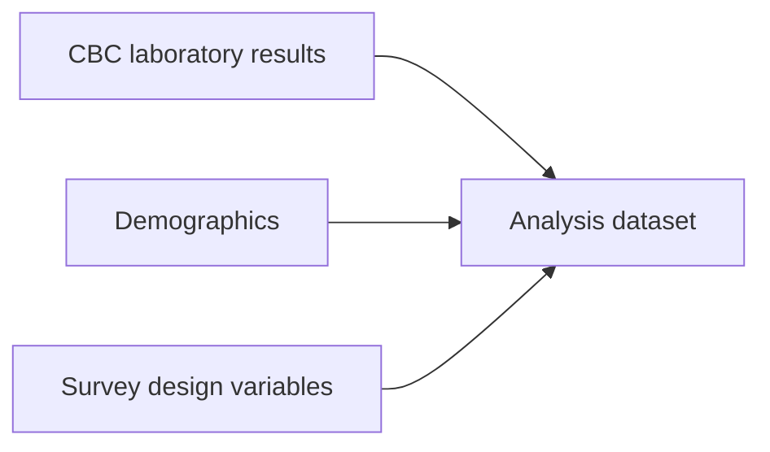
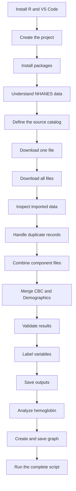

```{=html}
<section class="tutorial-hero" aria-labelledby="tutorial-title">
  <div class="home-shell tutorial-hero-grid">

    <div class="tutorial-hero-copy">

      <p class="kicker">
        <span class="status-dot" aria-hidden="true"></span>
        Beginner-friendly NHANES training in R
      </p>

      <h1 id="tutorial-title">
        Build the NHANES CBC and Demographic Data Pipeline from beginning to end.
      </h1>

      <p class="hero-lead">
        Learn how to use R and Visual Studio Code to download official NHANES
        Complete Blood Count and Demographic files, preserve survey-cycle
        metadata, investigate duplicate records, merge participants safely,
        validate the results, and create an exploratory analysis.
      </p>

      <div class="tutorial-meta-grid" aria-label="Course information">

        <div class="tutorial-meta-card">
          <span class="tutorial-meta-label">Level</span>
          <strong>Complete beginner</strong>
        </div>

        <div class="tutorial-meta-card">
          <span class="tutorial-meta-label">Estimated time</span>
          <strong>4–6 hours</strong>
        </div>

        <div class="tutorial-meta-card">
          <span class="tutorial-meta-label">Software</span>
          <strong>R + VS Code</strong>
        </div>

        <div class="tutorial-meta-card">
          <span class="tutorial-meta-label">Coverage</span>
          <strong>1999–2018</strong>
        </div>

      </div>

      <div class="button-row">

        <a class="button button-primary" href="01-welcome.html">
          Start Lesson 1
        </a>

        <a class="button button-secondary" href="18-full-script.html">
          View the complete script
        </a>

      </div>

    </div>

    <figure class="hero-figure">

      

      <figcaption>
        From official CDC source files to validated and reusable analytical data.
      </figcaption>

    </figure>

  </div>
</section>
```

::: {.callout-important icon="true"}
## Scope of this tutorial

The broader website is dedicated to reproducible **NHANES laboratory data pipelines in R**.

This tutorial focuses specifically on:

- Complete Blood Count laboratory data;
- Demographic data used to describe and link participants;
- survey-design variables stored in the Demographics files;
- ten continuous NHANES cycles;
- 1999–2000 through 2017–2018.

The workflow should not be applied automatically to every NHANES laboratory component. Glycohemoglobin, urine, lipids, chemistry, environmental biomarkers, and other components require their own eligibility, harmonization, method, weighting, and validation rules.
:::

## What you will build

By the end of this course, your R project will be able to:

- create an organized project directory;
- install and load required R packages;
- define CBC and Demographic source files;
- construct CDC download URLs;
- download SAS transport files;
- read `.xpt` files into R;
- add survey-cycle and source-file metadata;
- combine files across multiple cycles;
- identify repeated participant keys;
- distinguish exact duplicates from repeat examinations;
- preserve the 2001–2002 second CBC examination separately;
- validate `survey_cycle + SEQN`;
- merge primary CBC and Demographic records safely;
- create validation and duplicate-audit reports;
- save RDS and CSV outputs;
- summarize hemoglobin by cycle and sex;
- create and save an exploratory graph.

## Learning objectives

By the end of the tutorial, you should be able to:

1. Explain how continuous NHANES data are organized.
2. Distinguish laboratory data from supporting Demographic data.
3. Explain what `.R`, `.qmd`, `.xpt`, `.rds`, and `.csv` files are.
4. Run R code in Visual Studio Code.
5. Create a reproducible project structure.
6. Install and verify R packages.
7. Construct NHANES download URLs programmatically.
8. Read SAS transport files with `haven`.
9. Combine data using `dplyr`.
10. Detect duplicate participant keys.
11. Explain why duplicates should not be deleted blindly.
12. Separate primary and repeat CBC examinations.
13. Validate a composite participant key.
14. Merge CBC and Demographic data safely.
15. Create post-merge validation reports.
16. Save reusable and shareable data outputs.
17. Produce descriptive summaries and figures.
18. Explain why formal NHANES estimates require survey weights and design variables.

## Why CBC data need Demographics

The CBC laboratory files contain blood measurements.

The Demographics files provide supporting information such as:

- participant age;
- sex;
- race and Hispanic origin;
- education and income variables;
- interview and examination weights;
- masked variance strata;
- masked primary sampling units.

A laboratory file alone is therefore not sufficient for most meaningful analyses.



## The workflow you will reproduce



## Your final project structure

```text
nhanes-cbc-demo/
├── nhanes_pipeline.R
├── scripts/
│   └── nhanes_pipeline.R
├── data/
│   ├── raw/
│   │   ├── cbc/
│   │   └── demographic/
│   └── processed/
├── outputs/
│   ├── duplicate-reports/
│   ├── figures/
│   ├── tables/
│   └── validation/
└── README.md
```

## Two ways to complete the course

### Guided mode

Guided mode is recommended for beginners.

You will:

1. read the explanation;
2. copy one code section;
3. paste it into `nhanes_pipeline.R`;
4. run the code;
5. compare your result with the expected output;
6. complete the checkpoint;
7. continue to the next section.

[Start guided mode](01-welcome.qmd){.button .button-primary}

### Complete-script mode

Complete-script mode is for learners who have already completed the guided lessons or who want to rerun the full pipeline.

The final script can be executed with:

```bash
Rscript scripts/nhanes_pipeline.R
```

[Open the complete script lesson](18-full-script.qmd){.button .button-secondary}

## Course lessons

### Getting started

1. [Welcome and course overview](01-welcome.qmd)
2. [Install R and Visual Studio Code](02-install-r-vscode.qmd)
3. [Create the R project](03-create-project.qmd)
4. [Install the required R packages](04-install-packages.qmd)
5. [Understand NHANES data](05-understand-nhanes.qmd)

### Acquire the data

6. [Define the source-file catalog](06-define-source-catalog.qmd)
7. [Download one NHANES file](07-download-one-file.qmd)
8. [Download all required files](08-download-all-files.qmd)
9. [Inspect the downloaded data](09-inspect-data.qmd)

### Build and validate the pipeline

10. [Investigate and handle duplicate records](10-handle-duplicates.qmd)
11. [Combine files within each component](11-combine-components.qmd)
12. [Merge CBC and Demographic data](12-merge-data.qmd)
13. [Validate the merged results](13-validate-results.qmd)
14. [Create readable variable labels](14-label-variables.qmd)
15. [Save reusable outputs](15-save-outputs.qmd)

### Analyze and communicate

16. [Analyze hemoglobin data](16-analyze-hemoglobin.qmd)
17. [Create and save the graph](17-create-graph.qmd)

### Complete the course

18. [Run the complete pipeline script](18-full-script.qmd)
19. [Troubleshoot common problems](19-troubleshooting.qmd)
20. [Complete the course and plan next steps](20-completion.qmd)

## How each lesson is structured

Every lesson contains:

::: {.grid}

::: {.g-col-12 .g-col-md-6}
### Learning objective

What you should understand or be able to do by the end of the lesson.
:::

::: {.g-col-12 .g-col-md-6}
### Why this matters

The scientific or technical reason for completing the step.
:::

::: {.g-col-12 .g-col-md-6}
### Run this code

A copyable R section that fits into the final script.
:::

::: {.g-col-12 .g-col-md-6}
### Expected result

Console output, tables, files, or figures that you should see.
:::

::: {.g-col-12 .g-col-md-6}
### Checkpoint

A checklist confirming that the step worked.
:::

::: {.g-col-12 .g-col-md-6}
### Knowledge check

A short question that tests the central concept.
:::

:::

## Important duplicate-handling principle

The 2001–2002 release includes:

- `L25_B`, the primary CBC examination;
- `L25_2_B`, a second CBC examination.

The same participant can appear in both files.

Appending the two files by rows can therefore create duplicate participant keys.

::: {.callout-warning icon="true"}
## Do not use this as a shortcut

```r
dplyr::distinct(
  SEQN,
  .keep_all = TRUE
)
```

This code keeps one arbitrary participant row and discards the others.

It does not determine whether the other records are:

- exact duplicates;
- repeat measurements;
- complementary records;
- conflicting records.

The tutorial investigates the scientific meaning before deciding what to retain in the primary analytical dataset.
:::

## Expected final outputs

```text
data/processed/
├── cbc_primary_1999_2018.rds
├── cbc_second_exam_2001_2002.rds
├── demographics_1999_2018.rds
└── cbc_demographics_1999_2018.rds
```

```text
outputs/validation/
├── source_summary.csv
├── key_validation.csv
├── merge_validation.csv
├── package_versions.csv
└── session_info.txt
```

```text
outputs/duplicate-reports/
├── shared_second_exam_participants.csv
├── exact_duplicate_rows.csv
└── unresolved_conflicts.csv
```

```text
outputs/figures/
└── mean_hemoglobin_by_cycle_and_sex.png
```

## Survey-weight warning

The beginner analysis creates descriptive unweighted summaries.

Those summaries describe the analytical records in the dataset.

They are not automatically nationally representative.

Formal NHANES inference requires:

- the appropriate survey weight;
- `SDMVSTRA`;
- `SDMVPSU`;
- correctly constructed multi-cycle weights;
- complex-survey analysis methods.

Review:

- [NHANES Survey Design](../foundations/survey-design.qmd)
- [Selecting and Using Survey Weights](../foundations/survey-weights.qmd)
- [Combining Survey Cycles](../foundations/combining-cycles.qmd)

```{=html}
<section class="home-cta" aria-labelledby="tutorial-cta-title">

  <div class="home-shell cta-inner">

    <div>

      <p class="kicker">
        Ready to begin?
      </p>

      <h2 id="tutorial-cta-title">
        Start by understanding the pipeline and the data.
      </h2>

      <p>
        Lesson 1 introduces NHANES, Complete Blood Count data, supporting
        Demographic data, and the duplicate-handling problem that motivates
        the workflow.
      </p>

    </div>

    <div class="button-row cta-buttons">

      <a class="button button-light" href="01-welcome.html">
        Start Lesson 1
      </a>

    </div>

  </div>

</section>
```